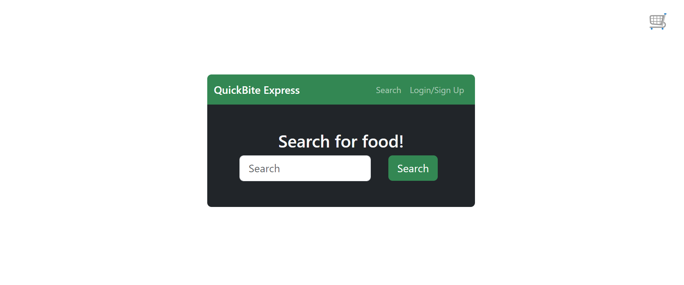

# QuickBite Express

## [Link to Application](https://quickbite-express-rbx4.onrender.com)   
  

## Table of Contents
-[Description](#description)  
-[Installation](#installation)  
-[Usage](#usage)  
-[Contributing](#contributing)    
-[Credits](#credits)  
-[License](#license)  
-[Questions](#questions)

## Description
Whether you are at home or travelling, QuickBite-Express is your go-to application for getting food delivered. With a user-firendly UI and sleek appearance, this app can be easily navigated by anyone. Simply search for a reastaurant in the search bar and view its menu to start adding items to your cart. When you have finished adding items, log in to checkout using stripe. This project uses node.js, express.js, react.js, vite, graphql, mongoDB, mongoose, bcrypt, jwt, react-bootstrap, stripe, appollo, and is deployed using render.  

## Installation
This application is fully deployed, so there is no installation needed. 

## Usage
To use this application, you can either start by searching for a restaurant or logging in. To log in, press the login/signup button on the navbar. A modal  will pop up with the login and signup forms. Select the signup form, fill out the empty fields and submit. The modal will close and you will be logged in. The navbar will ow have a logout option. To search for a restaurant type in its name in the search bar and press search. If that restaurant or multiple are present in the database then they will be listed on the screen. View the restaurant's menu by pressing select. Once you are brought to the restaurant's menu you can save the restaurant to your favorites and start adding items to your cart. To save the restaurant just press save underneath the restaurant's name while logged in. To add items to your cart press "Add to Cart". To checkout, click on the shopping cart on the top right of your screen. This will open the cart modal. Here, you can close the cart, remove items from the cart and change the quantity of a specific item in the cart. Once your order looks correct in your cart, press checkout and you will be redirected to stripe's payment page. In future development, after your info is entered and submitted, an order is submitted to the restaurant, and a driver request is also sent. To view your profile, press the "Profile" tab on the navbar. Your profile will display with your saved restaurants on the left and your account info on the right. To remove a restaurant from your favorites, press the remove button under that restaurant's name. To update your account info press the "Update Account Infoormation" button. A modal will pop up with options to update your username and email. Enter your new email into the update email form and your new email will be saved to the database. Enter your new username into the update username form and your new username will be saved to the database. If you want to delete your account, press the "Delete Account" button. This will remove your data from the database and return you to the homepage.

## Contributing
To contribe, fork the project, create a branch to work on, edit that branch, and then create a pull request. If the edits are approved, your contributions will be added.

## Credits
This project was created by Adam King, Piero Rodriguez, and Xing Cantres as a part of a University of Connecticut Web Development Bootcamp. References were made from that bootcamp at this repo: https://git.bootcampcontent.com/University-of-Connecticut/CONN-VIRT-FSF-PT-07-2023-U-LOLC.git. There were also references to the documentation for all of the technologies used, especially react, stripe, jwt, graphql, mongoDB and mongoose.

## License
This project is protected under MIT License

For more information about this license, click the following link: https://opensource.org/licenses/MIT

## Questions
To view more of my work, view my GitHub profile: [adaking1](https://github.com/adaking1)

If you have any questions about this project please email me here: kinga1215@yahoo.com

